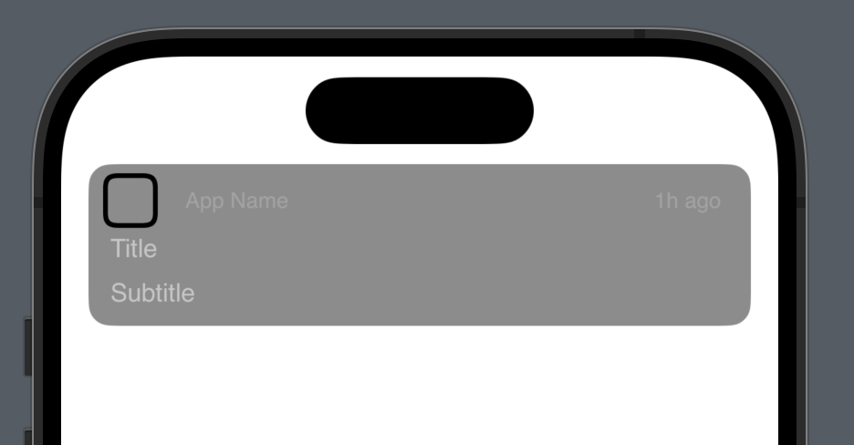

# SwiftUI




# **Custom SwiftUI Notification View**


Custom SwiftUI Notification View is a versatile and easy-to-use SwiftUI component that allows you to integrate elegant and customizable notifications into your SwiftUI projects. It simplifies the process of presenting user-friendly alerts, messages, or updates, enhancing the overall user experience of your app.

# **Features**

Easy Integration: Seamlessly integrate the notification view into your SwiftUI projects with minimal effort.
Customizable: Tailor the appearance and behavior of the notification to suit your app's design guidelines.
Animations: Add smooth and engaging entrance and exit animations to captivate users' attention.
Interactive: Support for interactive elements within the notification, providing users with actionable items.
Getting Started

Clone or download the repository: Custom SwiftUI Notification View.
Copy the NotificationView Swift file into your project.
Customize the appearance and behavior as needed.
Present notifications in your SwiftUI views to enhance user communication.


```swift
import SwiftUI

struct ContentView: View {
    @State private var showNotification = false
    
    var body: some View {
        VStack {
            // Your main content here
            
            Button("Show Notification") {
                self.showNotification.toggle()
            }
            .notification(isPresented: $showNotification, content: {
                NotificationView(title: "Title", subtitle: "Subtitle", time: "1h ago")
            })
        }
    }
}
```


# **License**

Custom SwiftUI Notification View is available under the MIT license. See the LICENSE file for more details.
